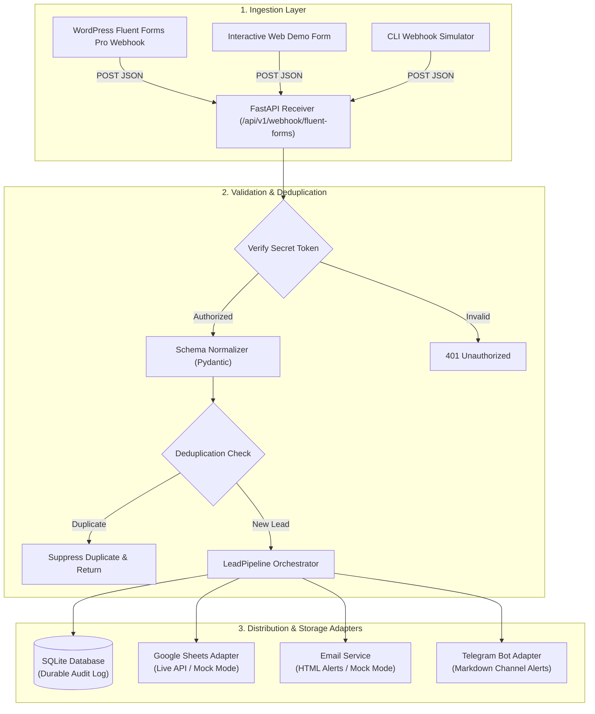
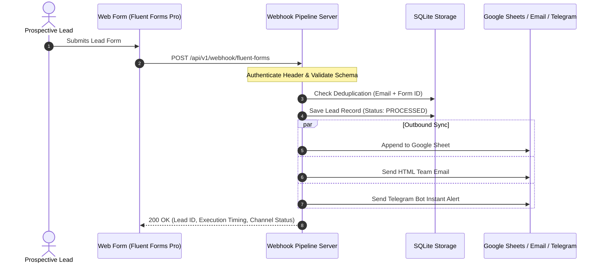

# Lead Processing & Notification Automation Demo

[](https://fastapi.tiangolo.com)
[](https://www.python.org)
[](https://www.sqlite.org)
[](https://core.telegram.org/bots/api)
[](LICENSE)

An asynchronous webhook ingestion service and automation pipeline inspired by real-world lead capture architectures. Built to ingest inbound payloads from form engines (**Fluent Forms Pro**), cleanse and normalize lead data, persist records to an audit database, synchronize to **Google Sheets**, and dispatch instantaneous alerts via **Email** and a **Telegram Bot**.

---

## Production Context

> **Notice:** This public repository is a sanitized demonstration implementation inspired by a real-world lead processing and notification automation workflow developed for business operations. The production implementation, company data, client credentials, and business-specific routing logic remain private to preserve confidentiality.
>
> This demonstration showcases the architectural patterns, validation schemas, resilience mechanisms, and multi-channel notification adapters without requiring proprietary dependencies or paid third-party licenses.

---

## Business Problem

In many businesses, inbound lead capture suffers from critical operational bottlenecks:

1. **Slow Lead Response Time (Speed-to-Lead):** Inquiries submitted via web forms often sit unread in email inboxes or CMS databases for hours, drastically reducing lead conversion rates.
2. **Brittle Point-to-Point Integrations:** Relying solely on basic CMS plugins to directly trigger external third-party APIs often causes lost leads whenever third-party services experience latency, rate limits, or network timeouts.
3. **Inconsistent Lead Hygiene & Spam:** Direct submissions frequently lack standardization (e.g. malformed phone numbers, un-normalized emails, rapid duplicate re-submissions).
4. **Scattered Lead Data:** Sales and marketing teams struggle when lead records are fragmented across multiple disparate tools without a central audit trail.

---

## Solution

This project provides a robust, decoupled **Lead Automation Middleware**:

- **Centralized Ingestion:** Provides a high-performance webhook endpoint (`/api/v1/webhook/fluent-forms`) that accepts raw JSON submissions.
- **Normalization & Validation:** Utilizes strict Pydantic schemas to sanitize phone numbers, format emails, map marketing UTM parameters, and preserve custom dynamic form fields.
- **Immediate Data Durability:** Persists every lead to an indexed SQLite database with duplicate detection before triggering outbound integrations.
- **Multi-Channel Distribution:** Concurrently pushes structured lead records to:
  - **Google Sheets:** For continuous marketing reporting and executive visibility.
  - **Transactional Email:** For official lead logs and customer auto-response.
  - **Telegram Bot:** For instant, sub-second team push notifications on mobile and desktop.
- **Zero-Friction Local Testing:** Includes both an interactive web form UI and a CLI simulator with automatic **Mock Mode** fallback so anyone can clone and test the complete pipeline in under 60 seconds without needing live API credentials.

---

## Architecture



---

## Workflow



---

## Technology Stack

- **Runtime:** Python 3.10+
- **API Framework:** [FastAPI](https://fastapi.tiangolo.com) & [Uvicorn](https://www.uvicorn.org) (Asynchronous, High Throughput)
- **Data Validation & Modeling:** [Pydantic v2](https://docs.pydantic.dev/) & Pydantic Settings
- **HTTP Client:** [HTTPX](https://www.python-httpx.org/) (Async requests to Telegram Bot API)
- **Persistence:** SQLite3 (Zero-setup local relational store)
- **Notification Services:**
  - **Telegram:** Telegram Bot API (Markdown formatted messages)
  - **Google Sheets:** Google Sheets API v4 with Mock Adapter
  - **Email:** Standard SMTP with responsive HTML template and Mock Adapter
- **Testing:** Pytest & FastAPI TestClient

---

## Project Structure

```
lead-processing-webhook-demo/
├── docs/
│   ├── architecture.md           # Deep-dive architectural breakdown
│   ├── webhook_flow.md           # API specification & sequence flows
│   └── fluent_forms_setup.md     # Production WordPress setup instructions
├── sample/
│   ├── fluent_forms_payload.json # Realistic raw webhook payload
│   ├── fluent_forms_multistep_payload.json
│   └── example_telegram_notification.md
├── src/
│   ├── core/
│   │   ├── config.py             # Environment settings & live/mock mode detection
│   │   └── logger.py             # Structured terminal logger
│   ├── schemas/
│   │   └── lead.py               # Pydantic normalization & validation schemas
│   ├── services/
│   │   ├── email_service.py      # Email notification adapter (SMTP / Mock)
│   │   ├── google_sheets.py      # Google Sheets integration (API / Mock)
│   │   ├── pipeline.py           # Core orchestrator coordinating all adapters
│   │   ├── storage.py            # SQLite repository & deduplication engine
│   │   └── telegram_service.py   # Telegram Bot notification adapter (API / Mock)
│   ├── static/
│   │   └── demo_form.html        # Interactive browser test form
│   └── main.py                   # FastAPI application entry point & routing
├── tests/
│   ├── test_services.py          # Unit tests for storage & adapters
│   ├── test_validation.py        # Normalization & schema tests
│   └── test_webhook.py           # End-to-end API integration tests
├── simulate_webhook.py           # CLI script to test webhook with sample payloads
├── .env.example                  # Environment configuration template
├── .gitignore                    # Prevents committing secrets, DBs, and logs
├── LICENSE                       # MIT License
├── README.md                     # Project documentation
└── requirements.txt              # Project dependencies
```

---

## Setup & Quickstart

### 1. Clone the Repository
```bash
git clone https://github.com/your-username/lead-processing-webhook-demo.git
cd lead-processing-webhook-demo
```

### 2. Create and Activate a Virtual Environment
```bash
python -m venv venv
# On Windows:
.\venv\Scripts\activate
# On macOS / Linux:
source venv/bin/activate
```

### 3. Install Dependencies
```bash
pip install -r requirements.txt
```

### 4. Configure Environment Variables
Copy the example environment file:
```bash
cp .env.example .env
```
*(By default, `.env.example` runs in **Mock Mode**, logging formatted dispatches directly to your console without needing real API keys).*

---

## Configuration

| Variable | Default | Description |
| :--- | :--- | :--- |
| `APP_ENV` | `demo` | Environment mode (`demo`, `development`, `production`) |
| `APP_HOST` | `127.0.0.1` | Host address to bind the web server |
| `APP_PORT` | `8000` | Port for the web server |
| `WEBHOOK_SECRET_KEY` | `demo_secret_token_12345` | Secret header token expected in `X-Webhook-Secret` |
| `DATABASE_PATH` | `leads.db` | Path to the local SQLite database file |
| `TELEGRAM_BOT_TOKEN` | `your_token_here` | Telegram Bot token from [@BotFather](https://t.me/botfather) |
| `TELEGRAM_CHAT_ID` | `your_chat_id_here` | Destination Telegram Chat / Channel ID |
| `GOOGLE_SHEET_ID` | `your_google_sheet_id_here` | Target Google Spreadsheet ID |
| `SMTP_HOST` | *(empty)* | SMTP Host (e.g. `smtp.gmail.com` or `smtp.sendgrid.net`) |

---

## Running the Demo

### Method 1: Interactive Browser UI
1. Launch the server:
   ```bash
   python src/main.py
   ```
2. Open your browser and navigate to:
   - **Demo Form UI:** `http://127.0.0.1:8000`
   - **Interactive API Docs (Swagger):** `http://127.0.0.1:8000/docs`
   - **Stored Leads API:** `http://127.0.0.1:8000/api/v1/leads`
3. Fill out the form and submit. You will see instant feedback showing pipeline metrics, SQLite persistence, and mock integration dispatches in real-time.

### Method 2: CLI Webhook Simulator
In a second terminal, trigger a simulated Fluent Forms Pro webhook payload:
```bash
python simulate_webhook.py
```

---

## Example Output

### 1. Telegram Notification Alert
When a lead is processed, the Telegram service dispatches this formatted alert:

```text
🚀 NEW INBOUND LEAD RECEIVED
━━━━━━━━━━━━━━━━━━━━━━
📋 Form: Consultation Request Form
🆔 Lead ID: LD-20260913-F3-E1428
👤 Name: Irfan Hakim
📧 Email: irfan.hakim@crestsol.com
📱 Phone: +60178829910
🏢 Company: Crest Solutions Sdn Bhd
🎯 Interest: Workflow & API Automation
💰 Budget: RM 15,000 - RM 30,000
📊 Campaign: google_search / q3_enterprise_automation
━━━━━━━━━━━━━━━━━━━━━━
💬 Inquiry Message:
Looking to automate inbound Fluent Forms submissions into Google Sheets and trigger immediate team notifications on Telegram.
━━━━━━━━━━━━━━━━━━━━━━
🕒 2026-09-13 13:30:00 UTC
```

### 2. Webhook API JSON Response (`200 OK`)
```json
{
  "success": true,
  "lead_id": "LD-20260913-F3-E1428",
  "message": "Lead processed and dispatched across all channels successfully.",
  "database_saved": true,
  "google_sheets_synced": true,
  "email_dispatched": true,
  "telegram_notified": true,
  "execution_time_ms": 14.8,
  "details": {
    "lead_summary": {
      "name": "Irfan Hakim",
      "email": "irfan.hakim@crestsol.com",
      "company": "Crest Solutions Sdn Bhd",
      "service_interest": "Workflow & API Automation"
    },
    "integrations": {
      "google_sheets": {
        "status": "success",
        "mode": "mock",
        "spreadsheet_id": "demo_leads_spreadsheet"
      },
      "email": {
        "status": "success",
        "mode": "mock",
        "recipient": "sales-team@demo.local"
      },
      "telegram": {
        "status": "success",
        "mode": "mock",
        "chat_id": "mock_chat_id"
      }
    }
  }
}
```

---

## Running the Automated Test Suite

The project includes unit and integration tests covering data validation, normalization schemas, storage persistence, deduplication, and API endpoints:

```bash
pytest tests/ -v
```

---

## Security Notes

1. **Secret Header Validation:** The webhook supports an `X-Webhook-Secret` header to ensure incoming POST requests originate exclusively from your WordPress instance.
2. **Environment Variable Isolation:** Sensitive secrets, database files, and log files are excluded from Git via `.gitignore`.
3. **Input Sanitization:** Contact details and freeform text areas are sanitized against injection before being passed into database queries or Telegram Markdown templates.
4. **Duplicate Spam Protection:** The built-in deduplication engine throttles identical lead submissions submitted within 60 seconds to protect downstream channels from bot loops.

---

## Limitations

- **Local Persistence:** The default database configuration uses SQLite, which is ideal for single-instance or local deployment, but should be replaced with PostgreSQL or MySQL in distributed, multi-server architectures.
- **In-Memory Rate Limiting:** Rate limiting in this demo is handled at the database query level; a high-traffic production system would benefit from an edge Redis layer.

---

## Future Improvements

- [ ] Add background task worker (Celery / RQ / FastAPI BackgroundTasks) for ultra-high throughput decoupling.
- [ ] Add WhatsApp Business Cloud API adapter alongside Telegram.
- [ ] Add direct CRM adapters (e.g. HubSpot, Pipedrive, Zoho CRM).
- [ ] Add lead qualification scoring via LLM agent (e.g. Claude / OpenAI API).

---

## Author & Contact

**Malek Saifullizan**  
*AI Automation & Internal Systems Developer*  
- Specialization: Business Process Automation, Internal Systems, API & Webhook Pipelines, Telegram Bots, AI Agents.
