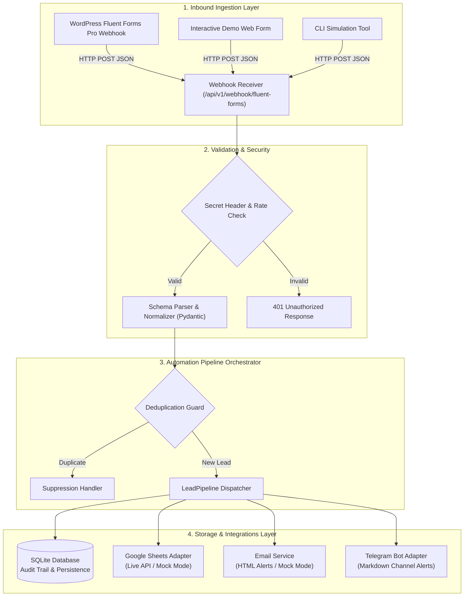
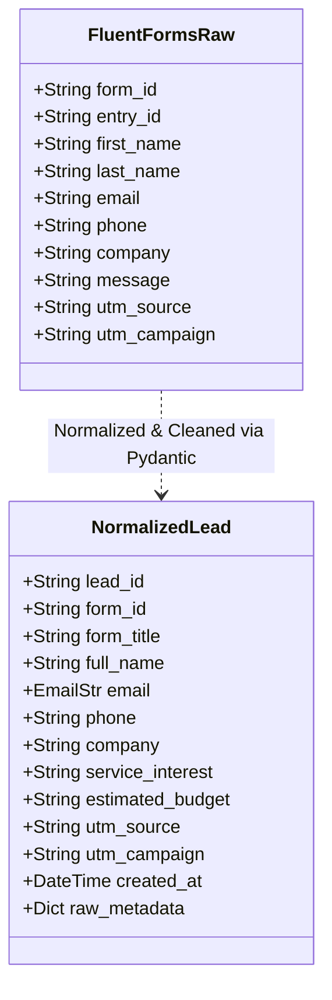

# System Architecture

## Overview
The **Lead Processing & Notification Automation System** is an event-driven webhook processing service designed to decouple public lead-capture forms from internal operations tooling (CRM, spreadsheets, and notification bots).

By routing inbound webhook traffic through this specialized processing service, businesses achieve:
1. **Resilience & Reliability:** If Google Sheets API or Telegram rate-limits temporarily, lead submissions are safely captured in SQLite database first and never lost.
2. **Data Cleansing & Normalization:** Irregular input fields from web forms are cleansed, deduplicated, and mapped to standardized schema models before reaching sales databases.
3. **Multi-Channel Distribution:** A single form submission fans out simultaneously to spreadsheets, email recipients, and real-time messaging channels (Telegram).

---

## Architectural Diagram

---

## Component Responsibilities

| Component | Technology | Primary Function |
| :--- | :--- | :--- |
| **FastAPI Ingestion** | Python / FastAPI / Uvicorn | Receives asynchronous webhook requests, authenticates header tokens, and returns structured execution metrics. |
| **Schema Validation** | Pydantic v2 | Standardizes messy form data, sanitizes phone numbers, normalizes emails, and maps UTM campaign tags. |
| **Deduplication Engine** | SQLite3 / SQL Index | Detects duplicate rapid re-submissions or matching entry IDs to prevent spamming sales channels. |
| **Local Lead Store** | SQLite3 | Stores durable lead records with complete payload metadata, processing status, and channel delivery flags. |
| **Google Sheets Adapter** | Google Sheets API v4 / Mock | Appends structured row records to the target spreadsheet for marketing and sales analysis. |
| **Email Adapter** | SMTP / Python `email` / Mock | Renders a clean responsive HTML email summary for internal team notification. |
| **Telegram Bot Adapter** | Telegram Bot API / `httpx` / Mock | Dispatches rich markdown-formatted instant alerts to team operations chats or channels. |

---

## Data Schema & Transformation

