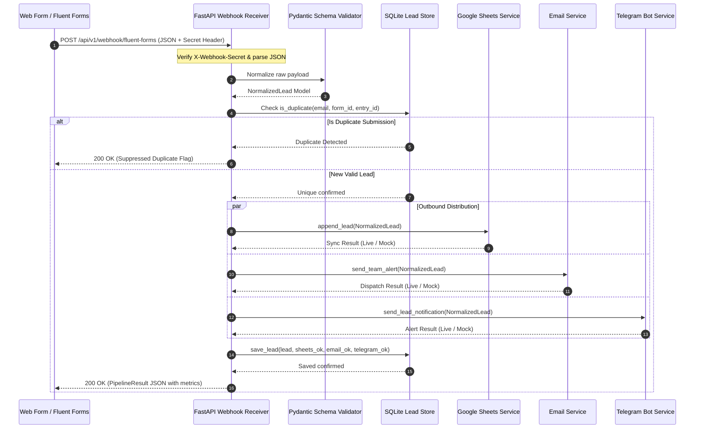

# Webhook Execution Flow & Sequence

This document describes the step-by-step lifecycle of an inbound lead payload.

---

## Sequence Diagram



---

## Webhook Endpoint Specification

### `POST /api/v1/webhook/fluent-forms`

#### Headers
| Header | Required | Description |
| :--- | :--- | :--- |
| `Content-Type` | Yes | `application/json` |
| `X-Webhook-Secret` | Optional (Required in Production) | Shared authorization token matching `WEBHOOK_SECRET_KEY` in `.env` |

#### Request Body (Example)
```json
{
  "form_id": "3",
  "entry_id": "1428",
  "form_title": "Enterprise Automation Inquiry",
  "first_name": "Tariq",
  "last_name": "Mansor",
  "email": "tariq.mansor@novatech.my",
  "phone": "+60139982145",
  "company": "NovaTech Solutions Sdn Bhd",
  "service_interest": "Workflow & API Automation",
  "estimated_budget": "RM 15,000 - RM 30,000",
  "message": "Need automated lead capture and Telegram notification pipeline.",
  "utm_source": "google_search",
  "utm_campaign": "b2b_lead_gen_q3"
}
```

#### Success Response (`200 OK`)
```json
{
  "success": true,
  "lead_id": "LD-20260913-F3-E1428",
  "message": "Lead processed and dispatched across all channels successfully.",
  "database_saved": true,
  "google_sheets_synced": true,
  "email_dispatched": true,
  "telegram_notified": true,
  "execution_time_ms": 18.4,
  "details": {
    "lead_summary": {
      "name": "Tariq Mansor",
      "email": "tariq.mansor@novatech.my",
      "company": "NovaTech Solutions Sdn Bhd",
      "service_interest": "Workflow & API Automation"
    },
    "integrations": {
      "google_sheets": {
        "status": "success",
        "mode": "mock",
        "spreadsheet_id": "demo_leads_spreadsheet"
      },
      "email": {
        "status": "success",
        "mode": "mock",
        "recipient": "sales-team@demo.local"
      },
      "telegram": {
        "status": "success",
        "mode": "mock",
        "chat_id": "mock_chat_id"
      }
    }
  }
}
```
